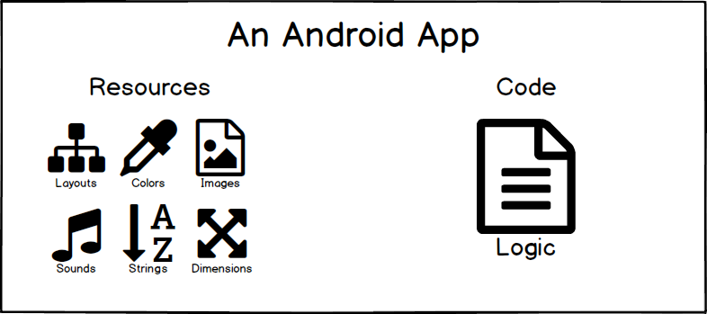

# Week 1

## Introduction

Congratulations on taking your first step to learning Android! By the end of this course, you'll learn how to create a few different Android applications that have different functionality such as a Birthday Card, Score Counter, Quiz App, and Music Player. We'll discuss how to create each application through a series of short lectures and lots of hands-on practice.

## Assumptions about you

- Basic computer skills
- Know how to use a smartphone
- Own a computer (Windows/Mac/Linux)

**Nice to have:**

- Prior programming experience (Not required)

## Preparing for your Journey

### Common obstacles

- Lack of confidence that you can be a developer
- Code looks intimidating
- Tools can be complex
- Lots of jargon
- Concepts are too abstract

### Visuals

For all the visual learners out there, I will be including plenty of drawings, analogies, and stories to explain technical concepts that can be confusing.



### Vocabulary

As mentioned earlier, there will be lots of jargon that you may have never heard of. Thankfully Google has put together a nice resource to learn from. You can see the [Vocabulary Glossary](https://developers.google.com/android/for-all/vocab-words/?hl=en) for more information.

### What Android Is

- Operating System (Based on Linux)
- Application Framework (Android SDK)
- Compiler and Packaging Tools

### Android Dashboard

<https://developer.android.com/about/dashboards/index.html>

### Android Architecture


### Programming Language

Java - <https://docs.oracle.com/javase/tutorial/>

```
public class Program {
    public static void main(String[] args) {
        System.out.println("Hello World!");
    }
}
```

C# - <https://www.microsoft.com/net/tutorials/csharp/getting-started>

```
public class Program
{
    public static void Main()
    {
        Console.WriteLine("Hello World!");
    }
}
```

### Layout Language

XML - <https://www.w3schools.com/xml/>

**Note:** Android XML uses Upper Camel Case. Camel Case is a way to write words without spaces that have a capital on each word.

EX: Look At This Sentence

Camel Case: LookAtThisSentence

### Installing the Android tooling

Android Studio (Java) - <https://developer.android.com/studio/index.html>

Visual Studio (C#) - <https://developer.xamarin.com/guides/android/getting_started/installation/>

## Android Basics - Views and ViewGroups

The first thing you need to learn in Android are called `Views`.

Views are rectangles that are drawn on the screen. They are the building block to build the layout for your application.


### TextView

A `View` that shows some Text.

### ImageView

A `View` that shows an Image.

### Button

A `View` that shows a Button.

## ViewGroup

A group of Views is known as a `ViewGroup`. A group of views are usually inside of a layout. Popular layouts like `LinearLayout` and `RelativeLayout` are considered `ViewGroup`.

### Challenge #1: What `Views` are inside this screen?


## Defining Views in XML

Views in XML have two main items:

1. Control Definition
2. Control Attributes

```
<TextView   
    android:text="Happy Birthday!"
    android:background="@android:color/blue
    android:layout_width="150dp"
    android:layout_height="75dp" />
```

or

```
<TextView   
    android:text="Happy Birthday!"
    android:background="@android:color/blue
    android:layout_width="150dp"
    android:layout_height="75dp">
</TextView>
```

## wrap_content and match_parent

`wrap_content` - Wraps until content fills height and width

`match_parent` - Matches the parent View's height and width

## Looking at Documentation

- Search Google with an Android keyword
- Use your browser's "Find Feature"
- Implement the code in Android Studio
- Deploy to Device!

## Quiz #1:

### Question 1:

If I want to show a picture on my phone, what XML element should I use?

### Question 2:

The following items are examples of what?

- `android:layout_width`
- `android:text`
- `android:src`

A) Design Items

B) Attributes

C) Definitions

### Question 3:

Write the following sentence in Camel Case:

"The Cow Jumped Over The Moon"

### Question 4:

`LinearLayout` and `RelativeLayout` are examples of what?

A) Group
B) ViewGroup
C) LayoutGroup
D) ObjectGroup

### Question 5:

You always need to ____ and ____ your XML tags.

### Question 6:

What is the width of the `TextView`?

```
<RelativeLayout
    android:layout_width="350dp"
    android:layout_height="match_parent">
    <TextView
    android:layout_width="match_parent"
    android:layout_height="wrap_content"
    android:text="Hello There" />
</RelativeLayout>
```

## Android Studio / Visual Studio Tour

Tour of screens in each IDE and walkthrough of basic project.

## App #1: Birthday Card

Design and implement a simple app that displays "Happy Birthday" to one of your loved ones.