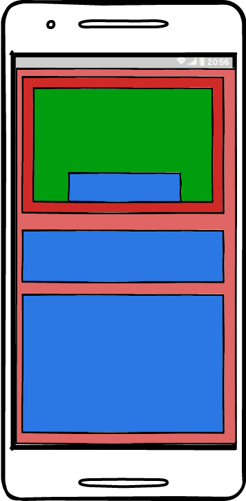
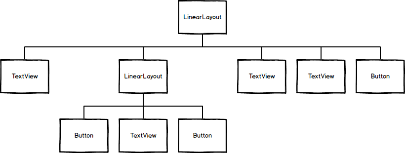

# Week 2

## Week 1 Summary

We had a high level view of what Android is, what tooling we can use to develop applications, and the basics of `Views` and `ViewGroups`. We ended our last session with a quick tour of Android Studio and the Android Designer.

## Nested ViewGroups



We talked about how a `ViewGroup` is a collection of `View` objects. But what about nesting a `ViewGroup` in another `ViewGroup`?

We can nest `ViewGroup` objects to make more complex and easy to understand layouts.

For example, `LinearLayout` is a simple `ViewGroup` that only allows content to be stacked either vertically or horizontally. Putting another `View` in front of another in a `LinearLayout` isn't possible because the `View` must stack.

However we can solve this problem by using a `RelativeLayout` since we know that we can place a `View` relative to another `View` which means we can stack `View` items.

## View Hierarchy

One useful tool is to break down your screens into a hierarchy of views. This helps you not only break out the concerns of each `ViewGroup`, but it also helps us when approaching the layout.



## Variables

In programming there is a concept called `variables`. `Variables` are contains that hold a `value` such as a number or piece of text. `Variables` should be named according to what it's holding.

### Integer - Stores numbers

```
int scoreCounter = 0;
```

### String - Stores text

C#:
```
string titleCaption = "Title";
```

Java
```
String titleCaption = "Title";
```

**Note:** You will notice that the syntax between C# and Java is sometimes the exact same. Otherwise it is off by either casing or naming.

## Variable Syntax

```
int myInteger = 0;
```

- Data Type 
- Variable Name 
- Assignment Operator 
- Initial Value

## Operators on Integers

- += - Addition assignment
- -= - Subtraction assigment

Example:
```
int addToMe = 0;

addToMe += 1;
```

You can also express this in a longer statement if you wanted.

```
int addToMe = 0;

addToMe = addToMe + 1;
```

## Methods

A `Method` is a list of instructions that will run when invoked inside of your code. For example, you might define an `Add` method which takes a number and adds it to another. 

## The OnCreate Method

The `OnCreate` method is a special method in Android that is called when the application is fully loaded and ready to start. When adding custom code, you will be adding it in this method majority of the time.

## Finding Views

What if we wanted to interact with our `View` objects? We need a way to get them inside our code. We can get a `reference` to the `View` object by using the `FindViewById` method.

## Setting up a Click Listener

Android uses a concept of `Listeners` which is an event listener pattern. These are typically a single event callback that is invoked when the `View` is interacted with.


Java
```
Button buttonAdd = (Button) findViewById(R.id.buttonAdd);

buttonAdd.setOnClickListener(new View.OnClickListener() {
            @Override
            public void onClick(View v) {
                //What happens in our onclick?
            }
        });
```

C#
```
Button buttonAdd = FindViewById<Button>(Resource.Id.buttonAdd);

buttonAdd.Click += (sender, e) => {
                //What happens in our onclick?
            };
```

## Quiz #1

What technique can we use to disect a layout? (Hint: Think how we can draw a layout out)

## Quiz #2

What are some reasonable names for a variable that holds the score for the away team at a basketball game?

## Quiz #3

What method does majority of your code belong in?

- OnStart
- OnCreate
- OnPause
- OnDestroy

## Quiz #4

What method do you use to get a `View` via code?

## Quiz #5

What do we create to handle a `Click` method on a `Button`?

- Listener
- Invoke
- Callback
- Handler

## App #2: Score Counter

Design and implement a score counter to keep track of your favorite sport.
