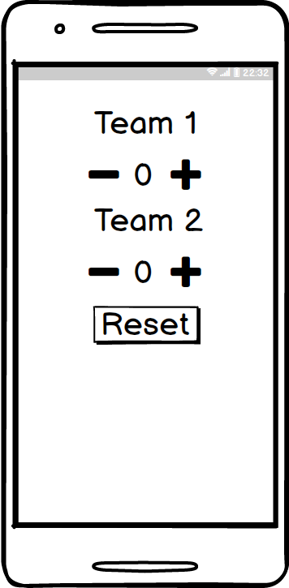

# Week 2 Lab

## Description

Create an android application that tracks score for your favorite sport.

The application should use nested `ViewGroups` and `int` variables to track score.

## Mockup



## Instructions

We learned earlier about how we can use nested `ViewGroups` to help us create a more sane layout. We also learned how to use the `addition assignment` and `subtraction assignment` operators. Use a combination of these items to create this app!

## Disect and implement the layout

Use nested `ViewGroups` and the `View Hiearchy` method to divide the mockup layout into consumable pieces. Once you understand it on paper, start creating the XML.

Here's a simple version of disecting this app. You can use this as a template to group the `Views` together in a nested `ViewGroup`:

- TextView (Team 1)
- Button (Team 1 Subtract Score Button)
- TextView (Team 1 Score)
- Button (Team 1 Add Score Button)
- TextView (Team 2)
- Button (Team 2 Subtract Score Button)
- TextView (Team 2 Score)
- Button (Team 2 Add Score Button)
- Button (Reset Score)

### Create the variables

The first thing you need to do is create a couple new `int` variables. Typically you want to define your variable at the top of your `MainActivity` so that it's `scope` allows for changes throughout your application.

EX:

```
public class MainActivity extends Activity {
    int awayTeamScore = 0;
    int homeTeamScore = 0;
    Button awayTeamAddScore;
    ...
}
```

### Find the Buttons

Remember that all of our code will be going into the `OnCreate` method other than our variables.

Next you'll want to use the special `findViewById` method to find each of your buttons. Since you'll have two buttons(add/subtract) for two teams, you'll have a total of four buttons you'll need to find.

**Hint:** Don't forget to assign an `id` to your `View`. Use the `android:id` attribute in your XML to accomplish this.

EX:

```
android:id="@+id/awayTeamAddScoreButton"
```

### Setup the Event Listeners

Now that we have references to all four of these buttons, we'll want to add a separate event handler for each one. Here's an example of one of these buttons:

```
awayTeamAddScoreButton.setOnClickListener(new View.OnClickListener() {
            @Override
            public void onClick(View v) {
                //Add our logic to add to the score variable.
                //Update the score TextView with the new value.
            }
        });
```

You will see that there are comments inside of the code I've pasted above. These are defined with a double forward slash `//`. 

## Real World Challenges

Now there are going to be some items that I leave out of each assignment that I challenge you to do a bit of real world research and figure out. 

Look at the documentation, read Stack Overflow answers, and use your IDE to help you figure out a solution to the problem.

For example, I have not told you how to display the variable's value to your `TextView`. You will have to find a method using the `.` intellisense inside your IDE to figure out how to set the text. 

**Hint:** We talked about the `text` attribute last class. We should think about how we can `set` that `text` with a `method`.
