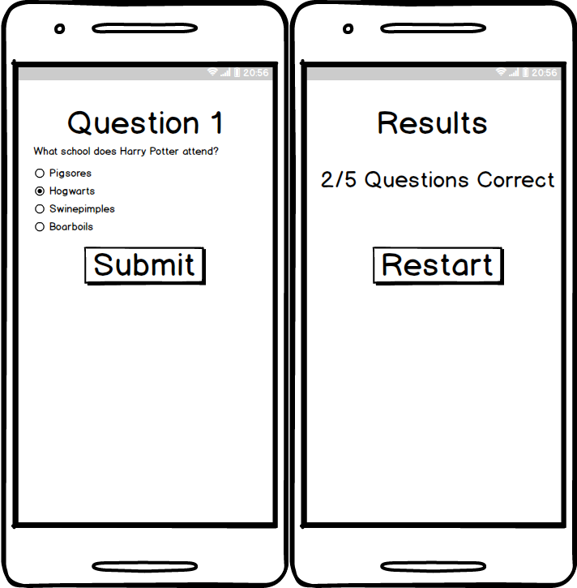

# Week 3 Lab

## Description

Create an android application that quizzes your user on 1 to 5 trivia questions and provides a score screen of how well they did out of the total questions. You should use Object Oriented techniques to define your `Question` with a `Text` string of the question, four `Answer` strings, and a `CorrectAnswer` int or string to indicate which of the answer strings is correct.

## Mockup

## Instructions

We learned about Object Oriented Programming and how we can create `Objects` to define real world objects through code. You task is to create an object that mimicks a quiz question.

Next we will need to define `if/else` statements to check whether a question is correct or not based on a `Checkbox's` `isChecked()` method which returns a bool value of true or false.

Finally, we will send our results of how many questions we got right to a separate activity to display our score via an `Intent`.

## Real World Challenges

This project has increased quite a bit in scope compared to the last project. There are many things we should think about when creating our `Objects` and the various methods we can create to validate if a question is correct or not.

My challenge to you is to identify what type of method we can create to check if an answer is correct or not and can be used everywhere.

**Hint:** If you know the `CorrectAnswer` position and pass in the selected `Checkbox` value, we should be able to check if the position is the same.

i.e. `CorrectAnswer` = 2

I can pass in whichever `Checkbox` has a `true` value to indicate it's selected. If I named that `Checkbox` with an `id` of the position such as `checkbox1`, I can use an `if` statement to check if `1 = 2`, which it does not. Therefore we know they answered this incorrectly.

You might also want to think about how you can control each `Checkbox` from multiple selection. Is this the right control for your quiz app? Do you want to support single selection or multiple selection of answers? What other control would work for this?
