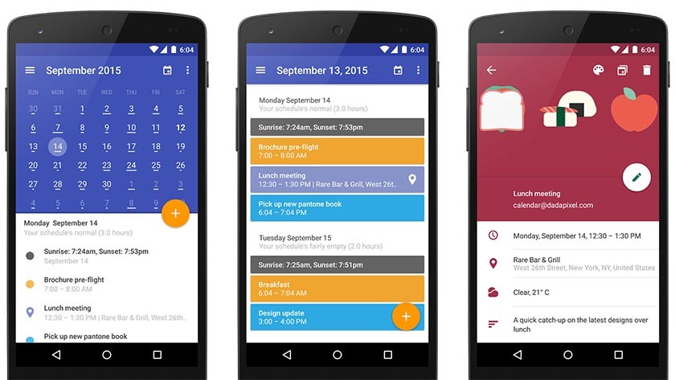

# Week 4

## Week 3 Summary

We learned about object oriented programming, how we can create objects that mimic what we're dealing with inside our application. We talked about a couple of methods of accessing resources in Android. We learned about If and Else statements to handle conditionals. Finally we talked about Intents and how we can give an intent to the next application.

## So you want to be an Android developer...

We have barely touched the tip of the iceberg in these last 4 weeks. However you should give yourself a big pat on the back for committing to something not many people even try in their lifetimes, which is learning how to program.

Now let's talk about the skills necessary to get an entry level position as an Android developer:

## Technical Skills

### Java Programming Course

<https://www.udacity.com/course/java-programming-basics--ud282>

### C# Programming Course

<https://mva.microsoft.com/en-us/training-courses/programming-in-c-jump-start-14254?l=j0iuozSfB_6900115888>

### Android SDK

Learn about the various APIs that the Android SDK provides. 

- A basic understanding of layouts and views
- Activities and their lifecycle
- User input
- Getting data from the web
- Storing data
- Collection views, Adapters
- Toolbar
- Sizes and Densities

<https://developer.android.com/index.html>

<https://developer.xamarin.com/guides/android/>

### Working with web services

- What is REST and how can we consume APIs?

<https://www.tutorialspoint.com/restful/>

## Source Control (Git)

- Allows you to store your projects online
- Allows you to maintain changes to your projects in an orderly manner
- Helps you create a process for developing your application

<https://try.github.io>

## Non Technical Skills

### Passion

Employers are typically looking for the most passionate people when filling a position. Passion can be quite a loaded word as it can mean many different things. What does passion mean to you? Are you passionate about your work? Are you passionate about the technology you work with? Are you passionate about the company's mission?

### Collaboration / Being a team player

Secondly, employers want to ensure you're a good team player. Do you bring up ideas whether they are good or bad to the table and provide feedback? Do you go out of your way to make a process better by collaborating with others? 

### Writing

How clear can you get your points across? In this day and age, there's not much time to read every single email or message we get. Being able to clearly express thoughts and ideas to others is a skill that is priceless.

## What employers typically want to see

### One published application

Employers want to see the fact that you've gone through the whole process of publishing an application to the app store. This shows that you've gone the extra mile and went from an idea for an application to being able to download it from any Android device.

### A College degree

In my opinion, a college degree is not needed for most development jobs. Most employers however will ask for a college degree or equivalent experience in the field. In this day and age, there is so much information out there to learn from. I find that one can easily prove their worth by publishing apps, open sourcing their projects, and simply by practicing programming.

### What makes an app good?

- It does one thing extremely well
- It's loyal to it's audience
- It's fast and reliable
- It feels polished
- It's straight to the point

### UI / UX Design (User Interface / User Experience)

<https://www.thinkwithgoogle.com/marketing-resources/experience-design/principles-of-mobile-app-design-introduction/>

<https://material.io/guidelines/>

## Books

Big Nerd Ranch:

<https://www.amazon.com/Android-Programming-Ranch-Guide-Guides/dp/0134706056/ref=zg_bs_377559011_4?_encoding=UTF8&psc=1&refRID=T0VW51S9DWH4EG4ZQZ49>

HeadFirst:

<https://www.amazon.com/Head-First-Android-Development-Brain-Friendly/dp/1449362184/ref=zg_bs_377559011_43?_encoding=UTF8&psc=1&refRID=NABRRXJY5JTSD42M38DJ>

## App #4: Build your own App

Design and implement an application of your desire! Use techniques from weeks 1-3 to create a layout for your application! I typically challenge you to go outside of your comfort zone, find an application that you use on a daily basis, and try to recreate a single screen from it.
