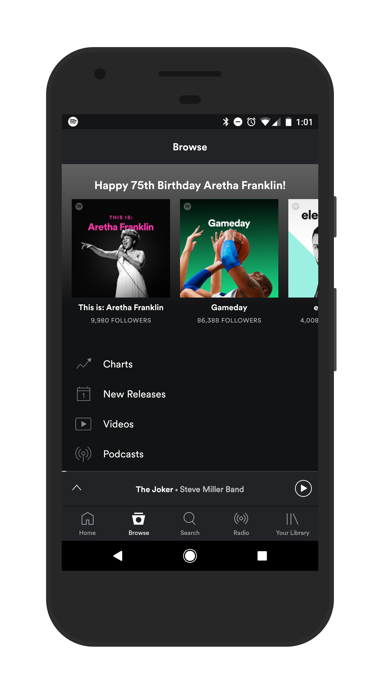

# Week 4 Lab

## Description

We've talked about quite a bit of things to get through in 4 weeks time. Now is your chance to show us what you've got! Use techniques from Weeks 1-3 to design and implement a single screen from one of your favorite applications. If you don't have a favorite application, try to implement a single screen from an app idea that you have. Think to yourself: `It would be cool if an app could do this...`

EX: I love Spotify, and one of my favorite screens is the browse screen. Although this screen is quite complicated at first, we can figure out what type of `View` and `ViewGroups` to mimic this screen.

I might first use the `View Hierarchy` technique we learned about to split this layout into seperate `ViewGroups`. I might then go on to separate each `ViewGroup` into individual `Views`.

Once I've got the basics of a skeleton for this layout, I would want to consider what each of these `View` elements might do. For example, if I hit the `Play` button, what do I expect should happen? I might think that the music might start playing again. As another example, I might select the `This is: Aretha Franklin` `ImageView`, as a user what would you think that might do? I would personally hope it would take me to a list of all of her greatest hits.

Finally, now that we've got the layout completed, we will want to wire up any `Button`, `ImageView`, `TextView`, etc with a `Listener` to handle any functionality we have in that application. This can be as simple as incrementing `variables`, to using `Intents` to send our user to a second `Acivity`.

Now is your time to shine! Show us what you've got!

